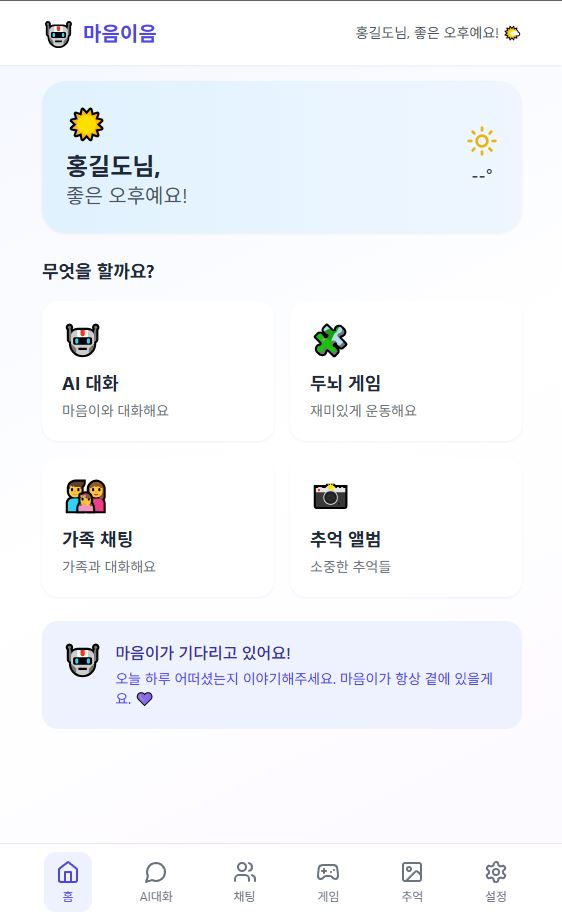
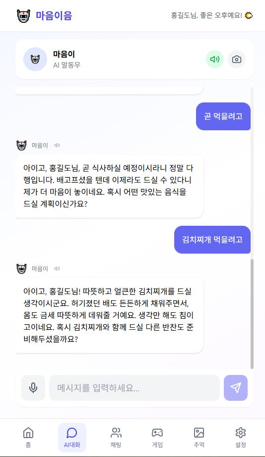
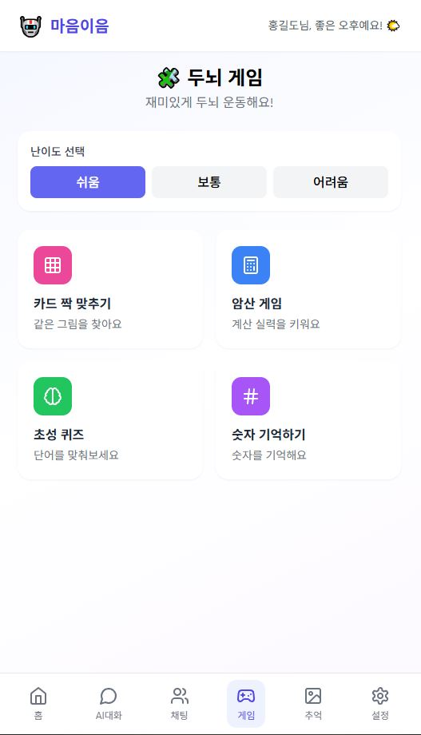

# 🤝 마음이음 (MindLink)

> **AI 기반 시니어 정서 케어 플랫폼**  
> 어르신과 보호자를 연결하여 정서적 교감과 인지 건강을 지원합니다.


<div align="center">

### 🌐 [Live Demo](https://mindlink-rouge.vercel.app)

</div>

---

## 📖 프로젝트 소개

**마음이음**은 독거 어르신의 정서적 고립 문제를 해결하기 위해 개발된 AI 기반 케어 플랫폼입니다.

### 🎯 개발 배경
- 고령화 사회에서 독거 어르신 증가
- 정서적 고립으로 인한 우울증, 치매 위험 증가
- 보호자의 원격 케어 필요성 대두

### 💡 해결 방안
- AI 대화 파트너를 통한 일상적 정서 교류
- 감정 분석을 통한 어르신 상태 모니터링
- 인지 게임으로 두뇌 건강 유지
- 보호자와의 실시간 소통 및 리포트 제공

---

## ✨ 주요 기능

### 👴 시니어 기능
| 기능 | 설명 |
|------|------|
| 🤖 **AI 대화** | Gemini AI 기반 공감형 대화 파트너 |
| 😊 **감정 분석** | 대화 내용 기반 실시간 감정 분석 |
| 🧠 **인지 게임** | 기억력, 계산력, 단어 맞추기 게임 |
| 📸 **추억 앨범** | 사진 업로드 및 댓글 소통 |
| 💬 **실시간 채팅** | 보호자와 1:1 채팅 |
| 💊 **복약 관리** | 약 복용 시간 알림 |

### 👨‍👩‍👧 보호자 기능
| 기능 | 설명 |
|------|------|
| 📊 **감정 리포트** | 어르신의 주간/월간 감정 변화 분석 |
| 🔔 **위험 알림** | 부정적 감정 감지 시 즉시 알림 |
| 📋 **대화 내역** | AI 대화 기록 확인 |
| 🎮 **게임 통계** | 인지 게임 결과 분석 |
| 📸 **추억 공유** | 앨범에 사진/댓글 추가 |
| 👥 **다중 연결** | 여러 어르신 관리 가능 |

---

## 🛠 기술 스택

### Frontend


### Backend


### Database & AI


---

## 📸 스크린샷

### 👴 시니어 화면
| 홈 | AI 대화 | 인지 게임 |
|:---:|:---:|:---:|
|  |  |  |

### 👨‍👩‍👧 보호자 화면
| 대시보드 | 감정 분석 | 추억 앨범 |
|:---:|:---:|:---:|
|  |  |  |

---

## 📁 프로젝트 구조

```
mindlink/
├── 📂 client/                 # React 프론트엔드
│   ├── src/
│   │   ├── components/        # 재사용 컴포넌트
│   │   ├── pages/
│   │   │   ├── senior/        # 시니어 전용 페이지
│   │   │   └── guardian/      # 보호자 전용 페이지
│   │   ├── hooks/             # 커스텀 훅
│   │   ├── stores/            # Zustand 상태관리
│   │   └── lib/               # API, 유틸리티
│   └── package.json
│
├── 📂 server/                 # Express 백엔드
│   ├── src/
│   │   ├── routes/            # API 라우트
│   │   ├── middleware/        # 인증 미들웨어
│   │   └── socket.js          # Socket.IO 설정
│   ├── prisma/
│   │   └── schema.prisma      # DB 스키마
│   └── package.json
│
└── README.md
```

---

## 🚀 실행 방법

### 1. 저장소 클론
```bash
git clone https://github.com/adke123/MINDLINK.git
cd MINDLINK
```

### 2. 환경 변수 설정

**server/.env**
```env
DATABASE_URL="postgresql://..."  # Supabase 연결 문자열
JWT_SECRET="your-secret-key"
GEMINI_API_KEY="your-gemini-api-key"
```

**client/.env**
```env
VITE_API_URL=http://localhost:4000
```

### 3. 데이터베이스 설정
```bash
cd server
npm install
npx prisma migrate dev
npx prisma generate
```

### 4. 서버 실행
```bash
# 백엔드 (터미널 1)
cd server
npm run dev

# 프론트엔드 (터미널 2)
cd client
npm install
npm run dev
```

### 5. 접속
- 프론트엔드: http://localhost:3000
- 백엔드 API: http://localhost:4000

---

## 🌐 배포

| 서비스 | URL |
|--------|-----|
| **Frontend** | https://mindlink-rouge.vercel.app |
| **Backend API** | https://mindlink-2ckj.onrender.com |

---

## 🔮 향후 계획

- [ ] 음성 인식 대화 기능
- [ ] 영상 통화 기능
- [ ] 위치 기반 안심 서비스
- [ ] 웨어러블 기기 연동
- [ ] 다국어 지원

---

## 👥 개발자

| 역할 | 이름 | GitHub |
|------|------|--------|
| 풀스택 개발 | 조건희| [@adke123](https://github.com/adke123) |

---

## 📄 라이선스

이 프로젝트는 MIT 라이선스를 따릅니다.

---

<div align="center">

**마음이음** - 기술로 세대를 연결합니다 💜

[🌐 Live Demo](https://mindlink-rouge.vercel.app) · [📧 문의하기](mailto:csn135790@gmail.com)

</div>
